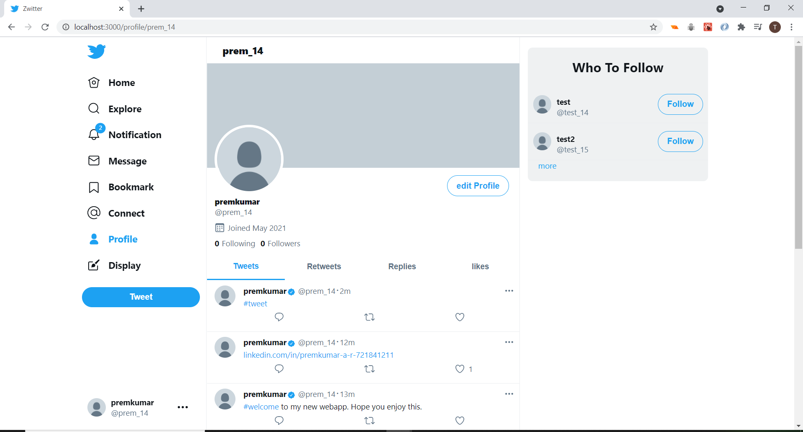
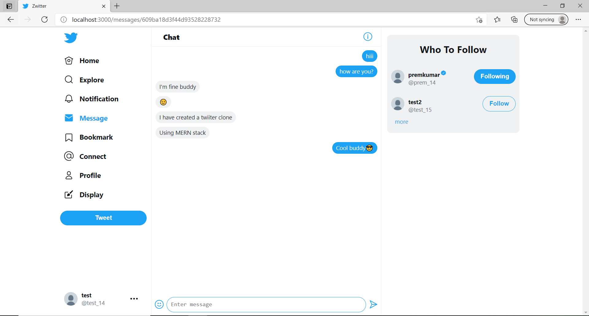

<h2>Tech stack</h2>
<ul>
  <li>ReactJs: Frontend</li>
  <li>NodeJs: Backend</li>
  <li>Express: Backend framework for node</li>
  <li>Mongodb: NoSql document-oriented database</li>
  <li>Mongoose: Object Data Modelling library for mongodb</li>
  <li>Cloudinary: For storing and delivering optimized images from cloud</li>
  <li>Socket.io: For realtime communication</li>
  <li>Redux: For managing the app state</li>
  <li>News API: For fetching latest news on different categories</li>
</ul>

<h2>Features</h2>
<ul>
  <li>Signup/Login</li>
  <li>Forgot/Change passwords</li>
  <li>Otp verification</li>
  <li>Tweet</li>
  <li>Like</li>
  <li>Retweet</li>
  <li>Reply</li>
  <li>Pin Tweet</li>
  <li>Bookmark</li>
  <li>Text links</li>
  <li>Hashtags</li>
  <li>Real time Notifications</li>
  <li>Login Alert</li>
  <li>Search Users and Hashtags</li>
  <li>News Feed</li>
  <li>Real time Messaging</li>
  <li>Group Messaging</li>
  <li>Upload profile and cover photos</li>
  <li>Edit Profile</li>
  <li>Color changing and themes</li>
  <li>logout</li>
</ul>

<h2>How to run Locally</h2>
<h3>Backend</h3>
  <h6>At the root of the backend create an .env file with the following contents:</h6>
  <h6>
  <ul>
    <li>CLIENT_ID='Oauth2 client id'</li>
      <li>CLEINT_SECRET='Oauth2 client secret'</li>
    <li>REDIRECT_URI='Oauth2 redirect uri'</li>
      <li>REFRESH_TOKEN='Oauth2 refresh token'</li>
  <li>MONGO_URI='Mongodb uri'</li>
  <li>FRONTEND_URL=''</li>
  <li>JWT_SECRET=''</li>
  <li>CLOUD_NAME='Cloudinary cloud name'</li>
  <li>CLOUD_API_KEY='Cloudinary api key'</li>
  <li>CLOUD_API_SECRET='Cloudinary api secret'</li>
  <li>NEWS_API='newsapi.org api key'</li>
  <li>TWILIO_ID='Twilio account id'</li>
  <li>TWILIO_TOKEN='Twilio account token'</li>
  <li>TWILIO_CALL_NUMBER='Twilio calling number'</li>
  </ul>
  </h6>

<h3>Frontend</h3>
  <h6>At the root of the frontend create an .env file with the following contents:</h6>
  <h6>
   <ul>
  <li>REACT_APP_SERVER_URL=''</li>
    <li>REACT_APP_LOCATION_API='api.ipdata.co api key'</li>
    <li>REACT_APP_GIF_API='giphy.com api key'</li>
  </ul>
  </h6>

<h1>Front Page</h1>

<h1>Signup</h1>

<h1>Login</h1>

<h1>Forgot Password</h1>

<h1>Home</h1>

<h1>Explore</h1>

<h1>Profile</h1>

<h1>Edit Profile</h1>

<h1>Profile Photo</h1>

<h1>New Message</h1>

<h1>Chat</h1>

<h1>Notifications</h1>

<h1>Connect</h1>

<h1>Search</h1>

<h1>Display</h1>

<h1>New login Alert</h1>

<h1>Change Password</h1>

<h1>Logout</h1>

